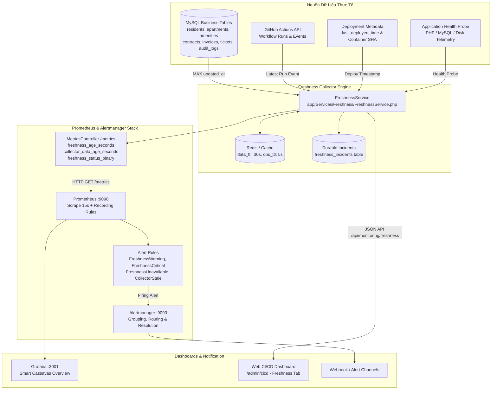

# KIẾN TRÚC GIÁM SÁT ĐỘ TƯƠI MỚI DỮ LIỆU (DATA FRESHNESS OBSERVABILITY)

Tài liệu này mô tả chi tiết kiến trúc, mô hình dữ liệu, ngưỡng cảnh báo, metric Prometheus, cấu hình Alertmanager, bảng điều khiển và quy trình kiểm thử của hệ thống **Data Freshness & Observability Monitoring** trong dự án Smart Apartment Management (`QUANLY_TOANHA-DANCU`).

---

## 1. MỤC TIÊU & NGUYÊN TẮC CỐT LÕI

Hệ thống được thiết kế theo chuẩn SRE (Site Reliability Engineering) với các nguyên tắc bất biến:
1. **Phân biệt rạch ròi 2 loại Freshness**:
   - **Data Freshness**: Dữ liệu nghiệp vụ thực tế trong CSDL (`residents`, `apartments`, `amenities`, `contracts`, `invoices`, `tickets`, `audit_logs`, `users`) được cập nhật khi nào?
   - **Monitoring Freshness**: Tín hiệu quan sát của hệ thống (`github_actions`, `deployment`, `application_health`, `collector`) được thu thập khi nào?
2. **Không đánh đồng Health với Freshness**:
   - Ứng dụng phản hồi `200 OK` (Healthy) không đồng nghĩa dữ liệu là Mới (Fresh).
   - Ngược lại, nếu Collector bị chậm hoặc chết, hệ thống giám sát chuyển sang `STALE`/`UNAVAILABLE`, không được báo toàn hệ thống Healthy.
3. **Tuyệt đối không giả mạo dữ liệu (Zero Fake Data)**:
   - Không hardcode các trạng thái Healthy/Fresh nếu không có dữ liệu thực tế.
   - Nếu nguồn chưa có bản ghi: trả về `UNKNOWN`.
   - Nếu nguồn lỗi, timeout, hoặc CSDL mất kết nối: trả về `UNAVAILABLE`.
   - `source_timestamp` bắt buộc là thời điểm thực tế của nguồn dữ liệu, **tuyệt đối không dùng `now()`** làm source timestamp.

---

## 2. KIẾN TRÚC TỔNG THỂ (SYSTEM ARCHITECTURE)

---

## 3. CÔNG THỨC & MÔ HÌNH TRẠNG THÁI

### 3.1. Công thức tính độ tươi mới:
$$\text{freshness\_age\_seconds} = \text{current\_time} - \text{source\_timestamp}$$

Trong đó:
- `source_timestamp`: Thời điểm thực tế phát sinh dữ liệu gần nhất tại nguồn.
- `current_time`: Thời điểm collector thực thi phép đo.
- `freshness_age_seconds`: Khoảng thời gian (giây) dữ liệu đã trôi qua.

### 3.2. Năm trạng thái chuẩn (Standard Freshness States):

| Trạng thái | Điều kiện | Ý nghĩa kỹ thuật |
| :--- | :--- | :--- |
| **`FRESH`** | $\text{age} < \text{warning\_threshold}$ | Dữ liệu tươi mới, nằm trong chu kỳ cập nhật kỳ vọng. |
| **`STALE`** | $\text{warning\_threshold} \le \text{age} < \text{critical\_threshold}$ | Dữ liệu bắt đầu trễ so với chu kỳ thông thường, cần theo dõi. |
| **`CRITICAL`** | $\text{age} \ge \text{critical\_threshold}$ | Dữ liệu quá cũ, vi phạm SLA, kích hoạt cảnh báo đỏ. |
| **`UNKNOWN`** | `source_timestamp = null` | Nguồn chưa có bản ghi nào hoặc chưa được ghi nhận lần đầu. |
| **`UNAVAILABLE`** | Lỗi kết nối / timeout / 429 / 5xx | Nguồn dữ liệu bị đứt kết nối, không thể đo lường. |

---

## 4. DANH SÁCH NGUỒN DỮ LIỆU & NGƯỠNG CẤU HÌNH

Hệ thống được cấu hình tập trung tại [`config/freshness.php`](file:///c:/Users/Asus/Downloads/QUANLY_TOANHA-DANCU/config/freshness.php), cho phép thay đổi qua biến môi trường (.env) mà không cần can thiệp mã nguồn:

### 4.1. Monitoring Signals (Tín hiệu giám sát)
| Nguồn (`source`) | Loại | Trường thời gian | Ngưỡng Warning | Ngưỡng Critical | Biến môi trường |
| :--- | :--- | :--- | :--- | :--- | :--- |
| **`collector`** | monitoring | `last_success_at` | 60s (1 phút) | 300s (5 phút) | `FRESHNESS_COLLECTOR_WARNING_SECONDS` |
| **`application_health`** | monitoring | `last_observed_at` | 60s (1 phút) | 180s (3 phút) | `FRESHNESS_HEALTH_WARNING_SECONDS` |
| **`github_actions`** | monitoring | `updated_at`/`created_at` | 3600s (1 giờ) | 86400s (24 giờ) | `FRESHNESS_GITHUB_WARNING_SECONDS` |
| **`deployment`** | monitoring | `.last_deployed_time` | 604800s (7 ngày) | 2592000s (30 ngày) | `FRESHNESS_DEPLOYMENT_WARNING_SECONDS` |

### 4.2. Business Data Tables (Bảng nghiệp vụ CSDL)
| Bảng (`table`) | Loại | Trường thời gian | Ngưỡng Warning | Ngưỡng Critical | Biến môi trường |
| :--- | :--- | :--- | :--- | :--- | :--- |
| **`audit_logs`** | data | `MAX(created_at)` | 7200s (2 giờ) | 86400s (24 giờ) | `FRESHNESS_AUDIT_WARNING_SECONDS` |
| **`tickets`** | data | `MAX(updated_at)` | 86400s (24 giờ) | 259200s (3 ngày) | `FRESHNESS_TICKETS_WARNING_SECONDS` |
| **`residents`** | data | `MAX(updated_at)` | 604800s (7 ngày) | 2592000s (30 ngày) | `FRESHNESS_RESIDENTS_WARNING_SECONDS` |
| **`apartments`** | data | `MAX(updated_at)` | 2592000s (30 ngày) | 7776000s (90 ngày) | `FRESHNESS_APARTMENTS_WARNING_SECONDS` |
| **`amenities`** | data | `MAX(updated_at)` | 2592000s (30 ngày) | 7776000s (90 ngày) | `FRESHNESS_AMENITIES_WARNING_SECONDS` |
| **`contracts`** | data | `MAX(updated_at)` | 604800s (7 ngày) | 2592000s (30 ngày) | `FRESHNESS_CONTRACTS_WARNING_SECONDS` |
| **`invoices`** | data | `MAX(updated_at)` | 2592000s (30 ngày) | 7776000s (90 ngày) | `FRESHNESS_INVOICES_WARNING_SECONDS` |
| **`users`** | data | `MAX(updated_at)` | 604800s (7 ngày) | 2592000s (30 ngày) | `FRESHNESS_USERS_WARNING_SECONDS` |

---

## 5. PROMETHEUS METRICS & RULES

Endpoint: `GET /metrics`

### 5.1. Danh mục Metrics
- `collector_data_age_seconds`: Gauge - Thời gian trôi qua từ lần collector chạy thành công gần nhất.
- `collector_last_success_timestamp`: Gauge - Unix timestamp lần collector thành công gần nhất.
- `collector_errors_total`: Counter - Tổng số lần thu thập freshness bị lỗi.
- `freshness_age_seconds{source="...",type="data|monitoring"}`: Gauge - Tuổi của nguồn tính bằng giây (-1 nếu không khả dụng).
- `freshness_source_timestamp_seconds{source="...",type="data|monitoring"}`: Gauge - Unix epoch của dữ liệu nguồn.
- `freshness_status_binary{source="...",type="...",state="fresh|stale|critical|unknown|unavailable"}`: Gauge (1 hoặc 0).

### 5.2. Alert Rules ([`docker/prometheus/rules/freshness_rules.yml`](file:///c:/Users/Asus/Downloads/QUANLY_TOANHA-DANCU/docker/prometheus/rules/freshness_rules.yml))
1. **`FreshnessWarning`**: Kích hoạt khi một nguồn ở trạng thái STALE liên tục trong 1 phút (`for: 1m`).
2. **`FreshnessCritical`**: Kích hoạt khi một nguồn ở trạng thái CRITICAL liên tục trong 1 phút (`for: 1m`).
3. **`FreshnessUnavailable`**: Kích hoạt khi một nguồn ở trạng thái UNAVAILABLE (mất kết nối CSDL hoặc API 5xx/429) liên tục trong 1 phút.
4. **`CollectorStale`**: Kích hoạt khi Collector không chạy quá 120 giây.
5. **`CollectorDown`**: Kích hoạt khi Collector không hoạt động quá 300 giây.

---

## 6. ALERTMANAGER & NOTIFICATION ROUTING

Tập tin: [`docker/alertmanager/alertmanager.yml`](file:///c:/Users/Asus/Downloads/QUANLY_TOANHA-DANCU/docker/alertmanager/alertmanager.yml)
- **Grouping**: Nhóm theo `[alertname, severity, source]` để gom cảnh báo.
- **Repeat Interval**: 4 giờ cho cảnh báo Warning, 1 giờ cho cảnh báo Critical.
- **Send Resolved**: Tự động gửi thông báo phục hồi (`RECOVERED`) khi dữ liệu tươi mới trở lại.
- **Inhibition Rules**: Khi sự cố `critical` đang diễn ra trên một nguồn, tự động triệt tiêu cảnh báo `warning` trùng lặp trên nguồn đó.

---

## 7. KIỂM THỬ TỰ ĐỘNG & BẢO ĐẢM TÍNH BỀN VỮNG

Bộ kiểm thử được viết bằng PHPUnit theo chuẩn framework:
- [`tests/Unit/FreshnessServiceTest.php`](file:///c:/Users/Asus/Downloads/QUANLY_TOANHA-DANCU/tests/Unit/FreshnessServiceTest.php): Kiểm thử phân loại trạng thái (`FRESH`, `STALE`, `CRITICAL`), xử lý thiếu dữ liệu (`UNKNOWN`), xử lý lỗi ngoại lệ (`UNAVAILABLE`), và ưu tiên trạng thái tổng thể.
- [`tests/Feature/FreshnessApiTest.php`](file:///c:/Users/Asus/Downloads/QUANLY_TOANHA-DANCU/tests/Feature/FreshnessApiTest.php): Kiểm thử endpoint `GET /api/monitoring/freshness` và các metric `GET /metrics`.
- **Durable Persistence**: Bảng `freshness_incidents` ghi nhận toàn bộ chu kỳ:
  $$\text{NORMAL} \longrightarrow \text{STALE} \longrightarrow \text{CRITICAL} \longrightarrow \text{RECOVERY} \longrightarrow \text{NORMAL}$$
- **Post-Deployment Verification**: Kịch bản [`scripts/freshness-verify.sh`](file:///c:/Users/Asus/Downloads/QUANLY_TOANHA-DANCU/scripts/freshness-verify.sh) được tích hợp trực tiếp vào [`scripts/deploy.sh`](file:///c:/Users/Asus/Downloads/QUANLY_TOANHA-DANCU/scripts/deploy.sh) (Giai đoạn 3). Nếu Collector hoặc CSDL bị UNAVAILABLE sau triển khai, quy trình tự động kích hoạt rollback.
